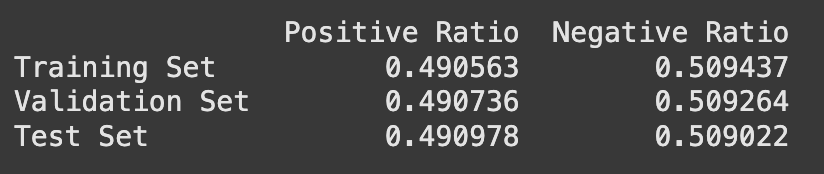
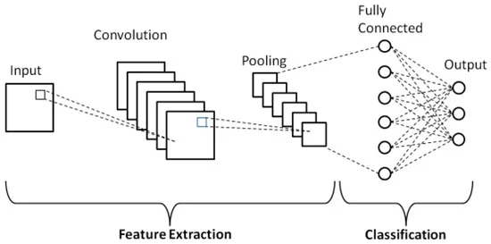

# CoV-Ab-Classifier
# Antibody Sequence Classification Using ProtBERT

## 1. Overview
The study focuses on training a model to classify antibody sequences for their specificity. Specifically, it aims to distinguish whether an antibody is specific to the wild-type (WT) SARS-CoV-2 virus only or is cross-reactive to other variants. ProtBERT, a pre-trained transformer-based model tailored for protein sequences, is used as the foundation for tokenizing sequences. A convolutional neural network (CNN)-based model is used for the classification task and trained on tokenized antibody sequences.

## 2. Specific Aims
Aim 1: Develop a classification model capable of identifying whether a given antibody sequence is specific to the WT SARS-CoV-2 or is cross-reactive to multiple variants.

Aim 2: Evaluate the performance of the fine-tuned ProtBERT model on a curated dataset of antibody sequences.

## 3. Background
The SARS-CoV-2 pandemic has driven the need for effective diagnostic and therapeutic antibodies. Understanding cross-reactivity is critical in vaccine design and therapeutic development, as cross-reactive antibodies provide broader protection against emerging variants. Recent advances in computational biology, particularly the use of transformer models like ProtBERT, have enabled effective representation learning for protein sequences, making it possible to classify and analyze sequence specificity efficiently.

## 4. Methodology

### 4.1 Dataset Preparation
Source: A curated dataset of antibody sequences was extracted from CoVAbDab(https://opig.stats.ox.ac.uk/webapps/covabdab/), labeled as WT SARS-CoV-2 -specific or cross-reactive based on published data.

Preprocessing:
All non-covid antibodies were removed from the database. The rest were labeled as either WT-specific(0) or cross-reactive(1).

Sequences were tokenized using ProtBERT’s tokenizer.

Data was randomly split into training, validation, and test sets with a 7:2:1 ratio while maintaining a 1:1 ratio between 0s and 1s within each set to ensure diverse representation and reduce label leakage.

### Dataset Split Result

### 4.2 Model
Base Model: A customized CNN.

Model Architecture:

Embedding Layer: Converts tokenized sequences into dense vectors.

Convolutional Layers: Apply multiple convolutional filters of varying sizes (3, 4, 5) to capture sequence motifs.

Max Pooling: Extracts the most salient features from each filter.

Dropout: Reduces overfitting with a dropout rate of 0.7.

Fully Connected Layer: Combines all features for binary classification.

### CNN Overview

### 4.3 Training
Loss Function: Binary cross-entropy.

Optimizer: Adam with a learning rate scheduler.

Metrics: Accuracy, F1-score, precision, and recall.

Regularization: Dropout and early stopping to prevent overfitting.

### 4.4 Evaluation
Evaluation was performed using the held-out test set.

### Results
Validation Accuracy: 0.51
Test Accuracy: 0.51

## 5. Discussion

### Strengths:

The CNN captured sequence-level features effectively. The use of CNN could benefit in data engineering (dataset testing) because of the faster speed compared to finutuning a protein language model.

The use of multiple filter sizes provided flexibility in feature detection.

### Limitations:

Poor Feature Representation:

The CNN might struggle to learn meaningful patterns distinguishing Class 1 due to:

	1.	Lack of discriminative features in the input data.
 
	2.	Overlap in feature space between Class 0 and Class 1.

Binary classification may oversimplify the specificity-cross-reactivity spectrum.

### Future Directions:

Analyze the embeddings for both classes (e.g., using PCA or t-SNE) to check if their feature representations are separable.

Input Preprocessing: Ensure that the tokenized sequences preserve meaningful differences between classes.

Feature Engineering: Incorporate additional features that could help distinguish Class 1 (e.g., sequence length, specific amino acid patterns).

Model Complexity: If the CNN is too simple, it may not capture subtle patterns in the data. Add more filters, layers, or increase the embedding dimension.

Expand dataset to include diverse antibody sequences across multiple variants.

Explore multi-class classification to capture nuanced specificity.
